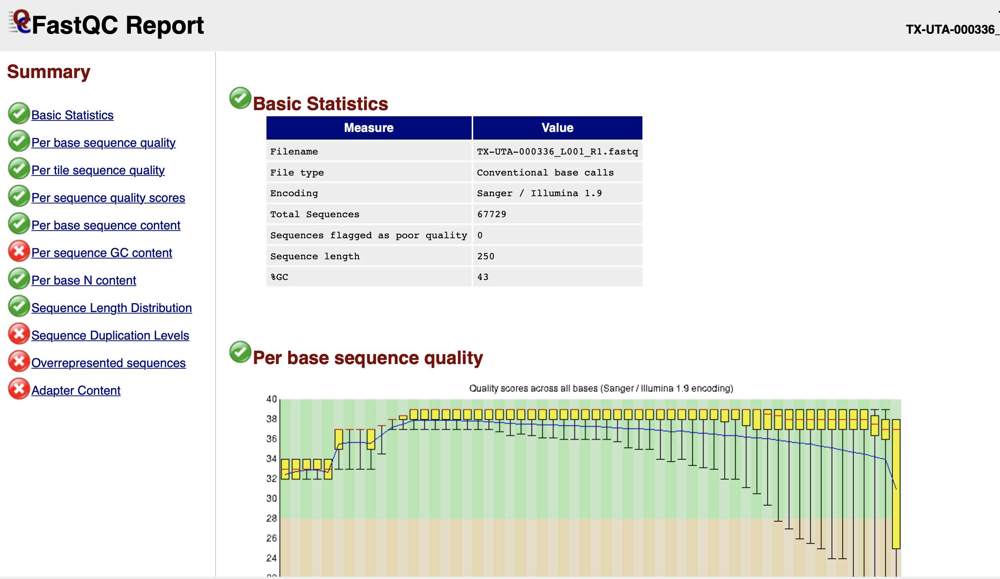
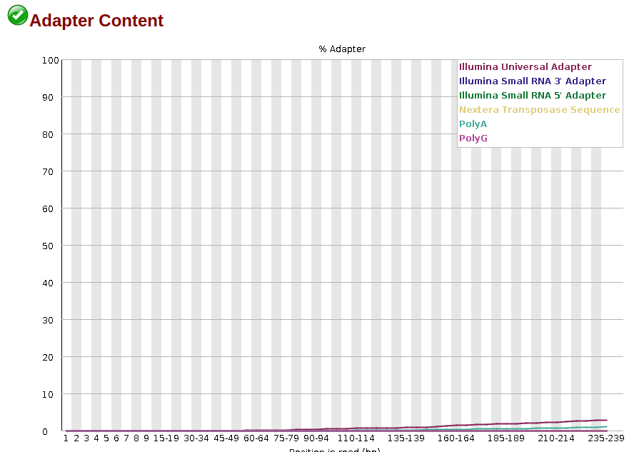

```diff
! What does "paired" library layout mean?
```
A paired library layout means that a "paired-end sequencing" was performed. In Illumina sequencing it is possible to sequence fragment in the sequencing library from both ends. This produces two files for each fragment, often denoted "R1" and "R2". These will most often come in two separate files.   

```diff
! How many sequence files can you expect from "paired" data?
```
You can expect two sequence files for each fragment in the library.   

```diff
! What is the "Run" accession for the sample you have selected? (begins with SRR... or ERR...).
```
This can for example be "SRR14253446". Often it begins with "SRR" or "ERR".   

```diff
! "Spots" is the number of sequenced reads (it refers to the read clusters on the sequencing array). Write down how many reads (spots) have been sequenced for your sample and the size of the file.  
```  
For SRR14253446 there are 67729 spots. 

This is an example of gzipped fastq files:  
```bash
$ ls
SRR14253446_1.fastq.gz  SRR14253446_2.fastq.gz
```

And here's after unzipping:  
```bash
$ ls
SRR14253446_1.fastq  SRR14253446_2.fastq
```

```diff
! How may lines does the two fastq files contain?
```
Using linux code:
```bash
wc -l SRR14253446_1.fastq SRR14253446_2.fastq 
  270916 SRR14253446_1.fastq
  270916 SRR14253446_2.fastq
  541832 total
```
We see that the files each contain 270916 lines.

```diff
! How many paired reads are in your files? Does this match with the number you found in the previous exercise?
```
In the fastq file format, each sequence (or read) covers four lines. So in the files above there are 270916/4 = 67729 reads. This matches the number of spots found in the SRA database.   

```diff
! What is the quality symbol (ASCII character) for the first nucleotide in the first read in the SRR..._1.fastq file?
```

```bash
(Module10) [jonbra@bioint02 Module10]$ zcat SRR14253446_1.fastq.gz | head -n 4
@SRR14253446.1 1 length=250
TGGTGAATACAGTCATGTAGTTGCCTTTAATACTTTACTATTCCTTATGTCATTCACTGTACTCTGTTTAACACCAGTTTACTCATTCTTACCTGGTGTTTATTCTGTTATTTACTTGTACTTGACATTTTATCTTACTAATGATGTTTCTTTTTTAGCACATATTCAGTGGATGGTTATGTTCACACCTTTAGTACCTTTCTGGATAACAATTGCTTATATCATTTGTATTTCCACAAAGCATTTCTAT
+SRR14253446.1 1 length=250
>ABAA@BFFFFFFDDGGGCGFGFFHHHHHG5FGGHHHHHHFGHHHHGHBDGHH5FG5GG5DGHFGGHHFHDHFH?ECFHHFHHHHHFHFHFHBEHHBFGEHFHHBGGEGFHHHH@BFDGHHGDDHGGFGFBGF4EF4FHHFFGFFH4GFHHHHHHGHFFGHHHEGHHHHEHH3FGEGD3FGDGGHHGFDCHDGFDGHFHHHHHFBFGHFHHF1DBDGHFHDGF1FHHHHBFDHF<FFBFGCHFHHHHHGG

```
Here the quality symbol for the first nucleotide is '>'. > has the ASCII value of 62. This means a Q-score of 29. A Q-score of 30 means 0.001 probability of a wrongly called nucleotide. We often use 30 as a cut-off, but I would say that we can trust this nucleotide.   

After FastQC: 

```diff
! How many sequences/reads are in your file? Is this what you expected?
```
The FastQC report says that there are 67729 reads in the file. This is what I expected.   

```diff
! How long are they?
```
They are all 250 bp. 

```diff
! Briefly describe the distribution of quality scores. Is the quality equally good along the entire sequence? Are there any differences in quality between pair 1 and pair 2 reads?
```
Normally with Illumina, the first nucleotides in a read can have slightly lower quality. Then the quality is generally very high until it drops towards the ends of the reads. This is because the sequencing reaction mixture starts to wear out, or the signal from the different "spots" gets weaker or more difficult to distinguish. R2 reads typically have lower quality than R1 reads.




```diff
! Are there any sequencing adapters present?
```
Yes, there are sequencing adapters present at the 3'ends of the reads. If you click on the link in the FastQC report called "Adapter Content", you can see an image like this: 
  

Here FastQC has detected the "Illumina Universal Adapter". 

```diff
! What are sequencing adapters and how did they get into your data?
```
Sequencing adapters are short pieces of DNA that are ligated to the ends of the DNA fragments before sequencing. In Illumina sequencing for example, these adapters ensure that the DNA fragments are attached to the "flow cell" (the glass plate with the fragments attached during sequencing), primer binding sites to make the polymerase start synthesizing DNA during the sequencing, and other necessary sequences. The adapters are also used to amplify the DNA fragments before sequencing.   

